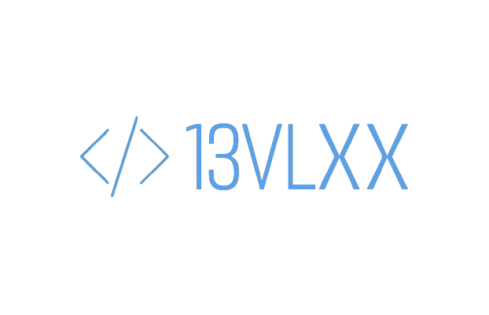
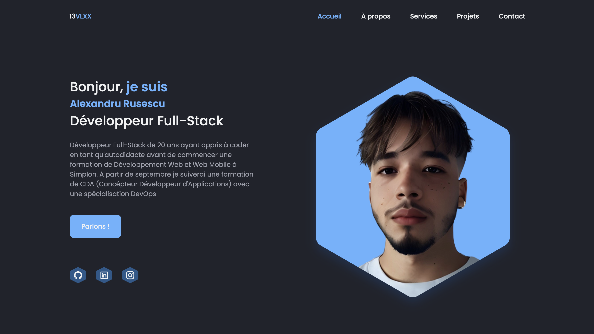
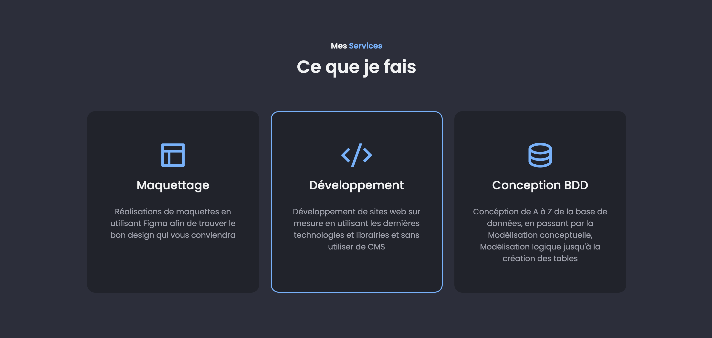
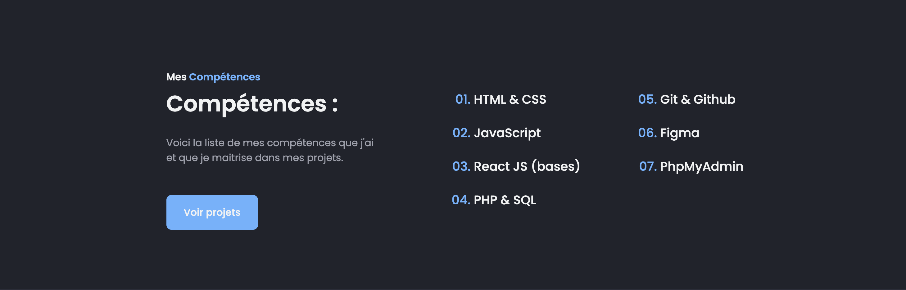
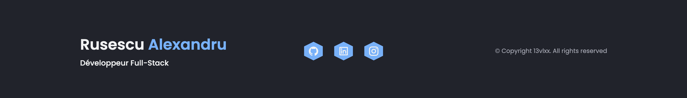

  

<h1 style="text-align:center; color: #65B3FF; font-weight: 200">Mon Portfolio</h1>

  <a target="_blank" href="https://rusescu-alexandru.netlify.app" style="background:#65B3FF; color: white; padding: 1rem 1.75rem; border-radius:0.5rem; display: inline-block; text-decoration: none;">
    Visiter mon site
  </a>

 

  

<!-- 13vlxx README.md -->
